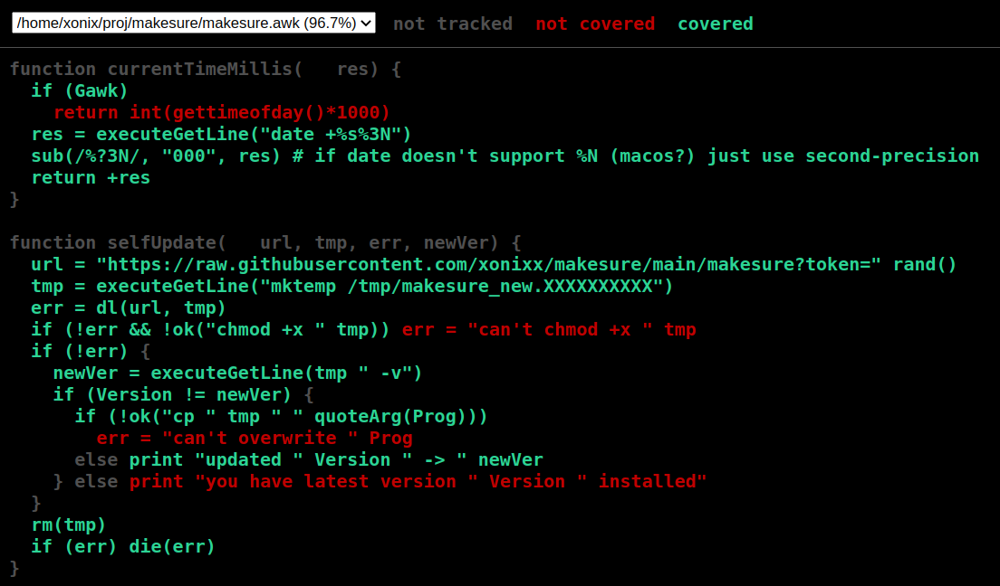

# Code coverage for GoAWK

GoAWK implements code coverage functionality, similar to the one built in the Golang itself (https://go.dev/blog/cover).



## How to use

To generate coverage report:
```
goawk -f a.awk -coverprofile c.out -covermode set    
```
This generates `c.out` file with coverage profile data for the `a.awk` program execution.
          
Now it's time to visualize the coverage report `c.out` by rendering it to HTML.

Please note. The code coverage functionality of GoAWK relies on Golang toolset.
So to generate the HTML coverage report (like on the screenshot above):
```
go tool cover -html=c.out
```

Please note. At the moment it's not possible to generate coverage report for AWK functions, similar to what is possible for Go:
```
go tool cover -func=c.out                # this will not work :(
```
This won't work because the `go tool cover` functionality for `-func` is only capable of processing the Go code. Luckily, the `-html` report option is generic enough to process any source code! 

If you don't provide the `coverprofile` argument for `goawk` but you do provide `-covermode`, it just prints to stdout the coverage-annotated source code (this might be useful for debug purposes):
```
goawk -f a.awk -covermode set
```


## CLI options for coverage

- `-coverprofile`
  - sets the cover report filename to put collected coverage profile data.
If this option is omitted, but the `-covermode` is set - outputs the annotated awk source to stdout.
- `-covermode`
  - Can have one of two values:
    - `set`: did each statement run?
    - `count`: how many times did each statement run? Produces heat maps report.
- `-coverappend`
  - if this option is provided the profile data will append to existing, otherwise the profile file
  will be truncated first

## Future work

TODO

## Feedback

Please [open an issue](https://github.com/benhoyt/goawk/issues) if you have bug reports or feature requests for GoAWK's code coverage support.
