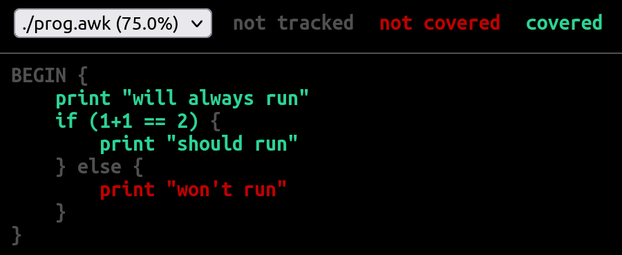

# GoAWK's code coverage feature

GoAWK implements code coverage functionality, similar to the [code coverage built into Go](https://go.dev/blog/cover). This feature was implemented by Volodymyr Gubarkov ([xonixx](https://github.com/xonixx)), primarily in [PR #154](https://github.com/benhoyt/goawk/pull/154).

Here is a screenshot using GoAWK's coverage feature on a simple AWK program (`prog.awk`):




## Basic usage

The simplest way to generate a coverage report is to run your AWK program with the `-coverprofile` option. To run the program in the default coverage mode and write the coverage report to `cover.out`, run the following:

```
$ goawk -f prog.awk -coverprofile cover.out
will always run
should run
```

This generates a file `cover.out` with coverage profile data for the execution of `prog.awk`.

We rely on the Go toolchain to visualize the coverage report, specifically the `go tool cover` command. This command renders a coverage report to HTML. If you don't have Go installed, [install it now](https://go.dev/doc/install).

To write the HTML coverage report (like the one shown in the screenshot above) to a temporary file and open a web browser displaying it, run the following:

```
$ go tool cover -html=cover.out
```

To write the HTML file to a specified file instead of launching a web browser, use `-o`:

```
$ go tool cover -html=cover.out -o cover.html
```

If you want to see coverage-annotated source code, use the `-d` option in addition to `-covermode`. This might be useful for debugging, or to see how GoAWK's coverage feature works under the hood:

```
$ goawk -f prog.awk -covermode set -d
BEGIN {
    __COVER["3"] = 1
    print "will always run"
    if ((1 + 1) == 2) {
        __COVER["1"] = 1
        print "should run"
    } else {
        __COVER["2"] = 1
        print "won't run"
    }
}
```


## All command-line options

- `-coverprofile fn`: set the coverage report filename to `fn`. If this option is specified but `-covermode` is not, the coverage mode defaults to `set`.
- `-covermode mode`: set the coverage mode to `mode`, which can be one of:
  - `set`: did each statement run?
  - `count`: how many times did each statement run? (produces a heat map report)
- `-coverappend`: append to coverage profile instead of overwriting it. This allows you to accumulate coverage data across several different runs of the program.


## Future work

- Add a way to support per-function coverage reporting, similar to `go tool cover -func=cover.out`.
- More complete handling for coverage of `if`/`else`. Not only do we want to check if the `if` body was visited, but we also want to handle the case where the `if` body was *not* visited.


## Feedback

Please [open an issue](https://github.com/benhoyt/goawk/issues) if you have bug reports or feature requests for GoAWK's code coverage support.
